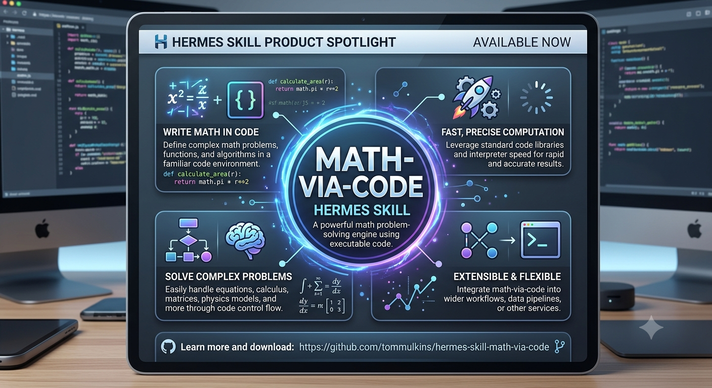

<p align="center">
  
</p>

# math-via-code

A [Hermes Agent](https://hermes-agent.nousresearch.com) skill that forces all arithmetic through code execution instead of in-head math.

## Why

LLM arithmetic is unreliable — accuracy degrades with context length, and even "simple" multi-step math produces wrong numbers. This skill was born from repeated errors in financial modeling: SDE calculations, P&L analysis, and facility rollups where a single transposed digit or premature rounding cascaded into incorrect deal evaluations.

The fix is simple: if there are more than two numbers involved, write code. Every time. No exceptions.

## Install

```
hermes skills install https://raw.githubusercontent.com/tommulkins/hermes-skill-math-via-code/main/SKILL.md --category software-development --name math-via-code -y
```

## What it does

- Routes all calculations of 3 or more numbers through `execute_code` or a Python script
- Enforces self-check assertions or cross-checks against source data
- Covers common calculations: SDE, margins, growth rates, annualizations, rollups, weighted averages
- Handles data from conversation, Excel/CSV files, or APIs
- Includes Excel-specific pitfalls (whitespace stripping, `data_only=True`, etc.)

## Who it's for

Anyone using Hermes Agent for financial analysis, data modeling, or any work where arithmetic accuracy matters.

## License

MIT
